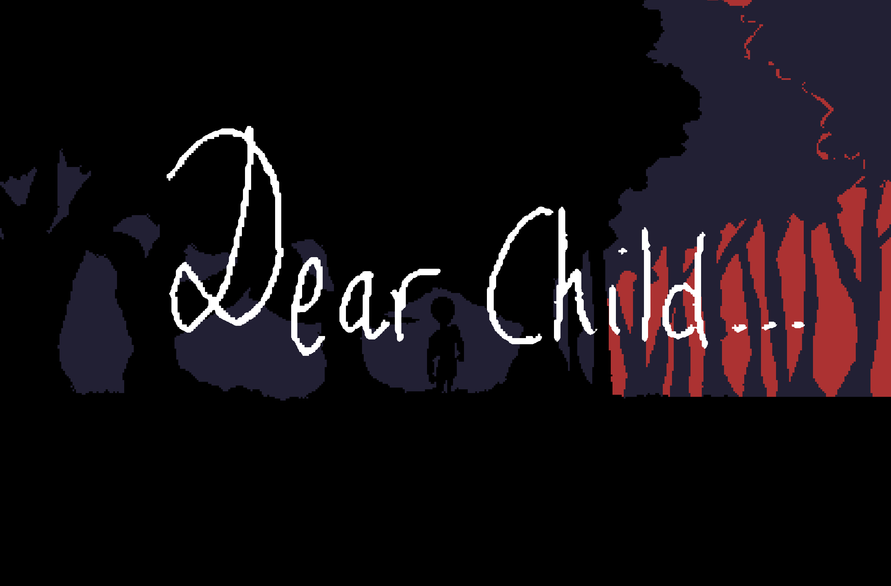

# LD48.DearChild

Welcome ! [DearChild](https://deformhead.github.io/LD48.DearChild/index.html) ([Ludum Dare 48 Theme: Deeper and deeper](https://ldjam.com/events/ludum-dare/48/ld48-dearchild)) is built in plain HTML5/JavaScript with a framework I am developping.

I challenged myself creating this game in only 24h instead of the regular 48h !

## Overview

It's more of a narrative experience than a game and I enjoyed working on it !

This was my third Game Jam, so I hope you'll like this game. Thank you for your support.

[Play to DearChild](https://deformhead.github.io/LD48.DearChild/index.html)

## Theatre

> *[Theatre](https://github.com/theatrejs) is a lightweight, simple and fast javascript game framework.*

This game is built with the [Theatre](https://github.com/theatrejs) game framework generator (see : [`generator-theatre`](https://github.com/theatrejs/generator-theatre)).

## [Change Log](./CHANGELOG.md)

## [License](./LICENSE)
